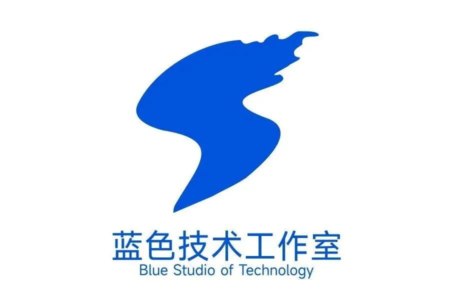
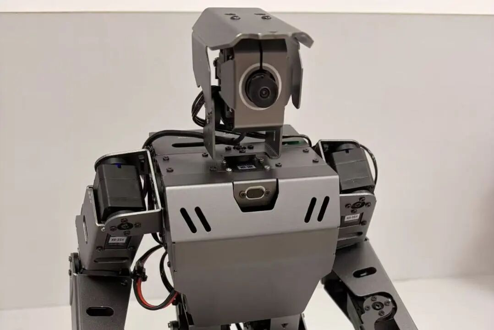
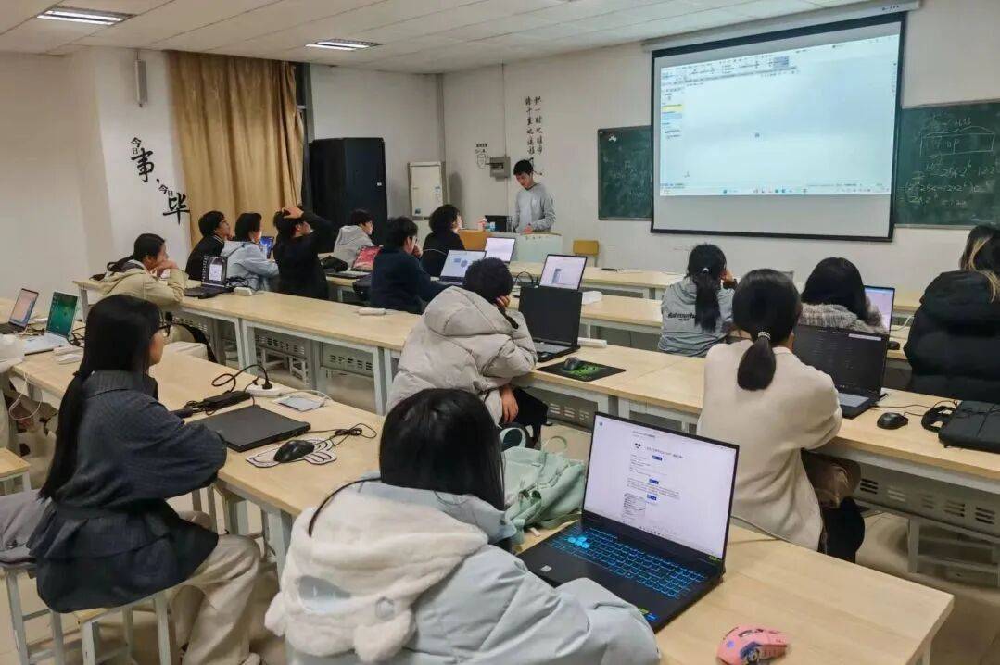
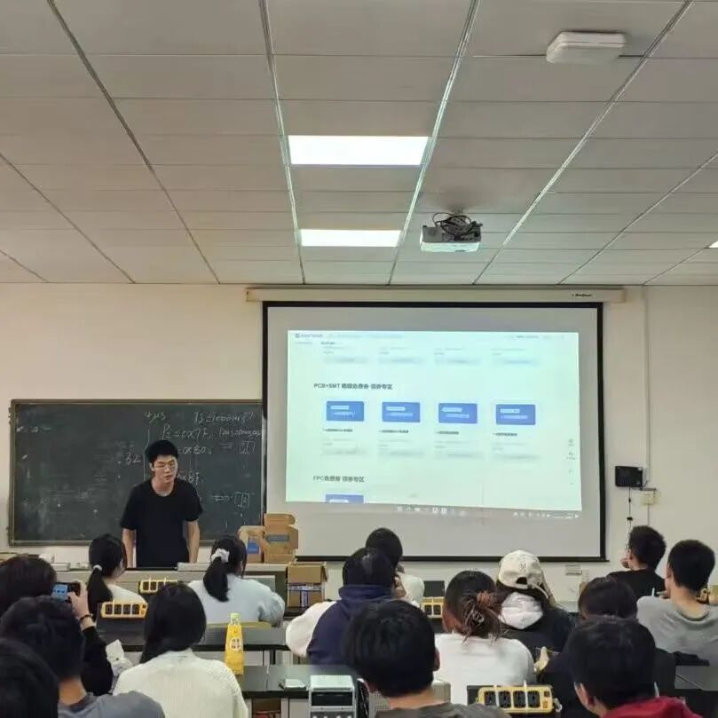
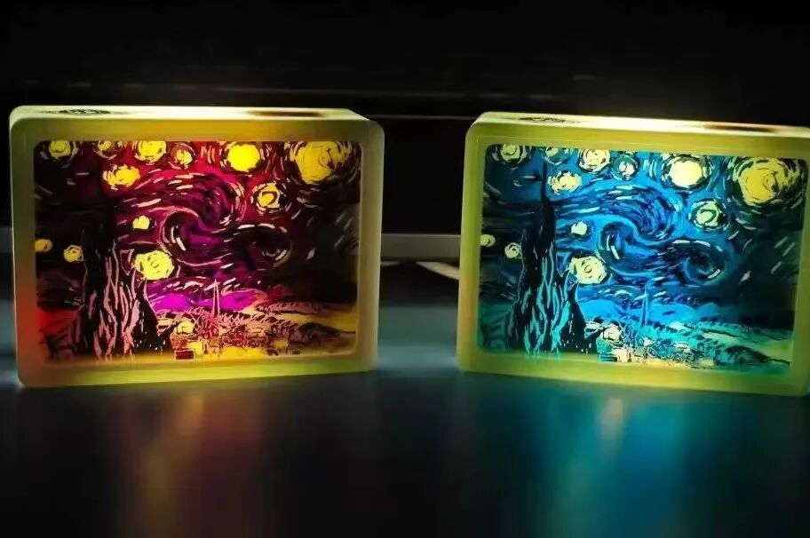
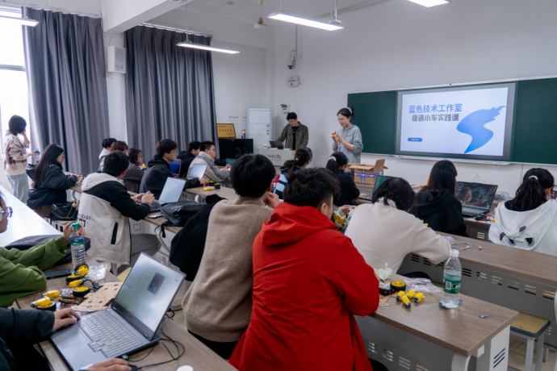
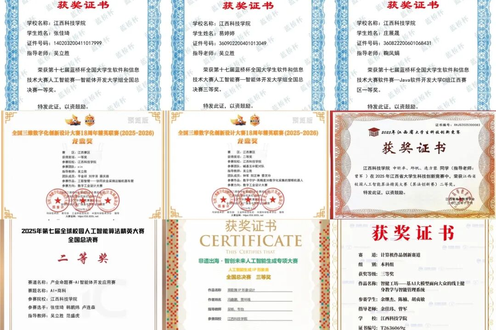

如果你心怀科创梦想，渴望提升实践能力，蓝色技术工作室向全体新生发出诚挚邀约！**无论有无基础，只要热爱科技、愿意学习**，就来和我们参与项目、征战竞赛。

# **蓝色技术工作室 招新啦！**

**——邀新生共赴科创之旅**

---

## PART 1 工作室介绍

蓝色技术工作室（Blue Studio of Technology）成立于 **2011 年 10 月**，是江西科技学院学术科技类学生团队，由信息工程学院指导。工作室在吴立胜老师带领下，以 **"竞赛驱动 + 产教融合"** 模式，打造全周期科创闭环生态。

- 2016 年入驻红绿蓝众创空间，孵化猎手猫等企业
- 2024 年向 AI 智能体、机器人前沿方向转型
- 下设**软件组、硬件组、AI 组、运营组**四大组别

欢迎全校各院系同学加入。

---

## PART 2 组织模式

### 01 软件组

主攻软件开发、嵌入式与算法处理，学习 C/C++、Python、Java 等语言，负责智能设备程序编写、功能调试，对接软件类竞赛，参与项目完整开发流程，锻炼代码设计与问题调试能力。

### 02 硬件组

负责电路设计、PCB 绘制、元器件焊接与调试，开展传感器、电机控制系统搭建，制作智能小车、机器人等实物样机，参与电子设计、智能汽车类竞赛，强化硬件实操与故障排查能力。

### 03 AI 组

紧跟人工智能前沿，学习 Python AI 工具链，开展图像识别、智能体搭建、数据集处理、AI 应用开发，对接人工智能相关赛事，在实践中掌握热门 AI 技术落地应用。

### 04 运营组

为工作室综合中枢，负责招新策划、活动组织、推文海报制作、对外联络、资料归档，统筹协调各组工作。**无需编程硬件基础**，适合擅长文案、策划、宣传的同学，维护团队整体对外形象。

---

## PART 3 特色实践活动

### 新生课程培训周

工作室开展为期一周的新生课程培训，设置电脑基础竞赛、单片机等四大前沿领域课程。由学长学姐开展授课，夯实成员编程基础，构建计算思维，结合实战赛题积累竞赛经验，帮助新生快速入门科创。

### 锡焊实践课

在锡焊实践活动中，同学们化身技术实践者，亲手制作 **"梵高星空灯"**。大家学习锡焊操作技术，在动手焊接的过程感受科技与艺术碰撞，把理论知识落地为实体作品，体验硬件制作的乐趣。

### 循迹小车设计与实践

面向零基础同学开展循迹小车实践活动。从原理讲解、电路搭建到整车组装调试，在学长学姐指导下完成小车制作，让小车按照预设轨迹行驶，锻炼硬件组装、程序编写以及团队协作能力。

---

## PART 4 实力风采

团队累计斩获 **80 余项国家级、400 余项省级奖项**，获评：

- 全国高校"活力社团" TOP100
- 江西省高校"活力社团" TOP10
- 校"自强之星"优秀团体

不必畏惧从零起步，期待满怀热忱的你加入，与我们并肩科创，解锁属于你的大学高光时刻！

---

## PART 5 常见问题解答

**Q：没有技术基础可以加入吗？**

A：完全可以加入。工作室的培训活动就是面向零基础新生开设的，工作室有指导老师以及经验丰富的学长学姐带教，会从基础知识点循序渐进教学。比起现有的技术储备，我们更看重你的学习热情、坚持钻研的态度，只要愿意花时间学习，都能够在这里得到成长。

**Q：不是信息工程学院的学生可以报名参加吗？**

A：我们面向全校所有院系开放招新，专业不受限制。运营组适合文科类同学，硬件、软件、AI 组同样欢迎其他专业对科技感兴趣的同学，很多跨专业的成员也在工作室做出不错的项目成果。

**Q：加入工作室会占用很多课余时间吗？会不会影响正常上课学习？**

A：所有活动、实践都安排在课余时间，不会和课堂教学冲突。时间实行弹性参与，日常上课优先，鼓励大家平衡好学业与科创，在完成课业的前提下参与工作室学习实践。

---

## 招新咨询

想要了解更多工作室招新细则、报名方式，或是还有其他疑问的同学，可以扫描下方 QQ 群二维码进群。群内会有学长学姐在线答疑，同步招新时间、报名流程等重要通知，欢迎感兴趣的新生扫码入群！

---

## 制作人员

| 职责 | 人员 |
| ---- | ---- |
| 文字 | 阳芷琳 李依璐 |
| 图片 | 阳芷琳 李依璐 |
| 排版 | 阳芷琳 李依璐 |
| 审校 | 钟军 范林辉 |
